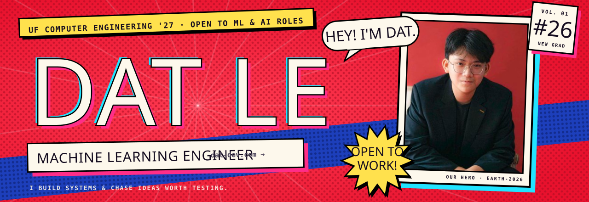
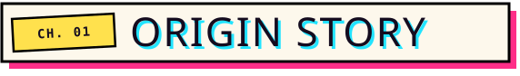
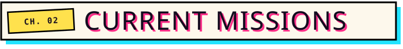
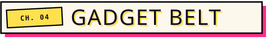
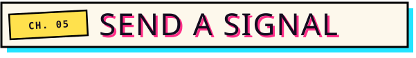

  
  
  

I'm Dat, a Computer Engineering student at the **University of Florida ('27)** who builds machine learning systems end to end: from the math in a research proof to the cron job that ships the model.

- **ML Engineer Intern @ VSP Vision** (2026): deployed 2 production models through Snowflake Model Registry over 50M+ row pipelines, and co-designed the team's ML release template.
- **AI Engineer Intern @ Viettel AI** (2025): a Jamba-lite (Mamba SSM + attention) model predicting the next network fault from 2.6M alarms across 3.3k fault classes.
- **Published at ASABE 2025**: plant tracking + SAM segmentation for strawberry canopy estimation, 0.924 IoU.
- **FinTech SWE Intern @ FPT** (2024): a LLaMA 3.1 + RAG task-management assistant.

- **Theoretical ML Researcher @ UF**: tracing fine-tuned behavior back to the individual training tokens that caused it, using per-token gradients, LoRA and EKFAC.
- **Quant Developer @ AlgoGators Investment Fund**: market-data ETL on PostgreSQL + Docker, and tail-event detection with XGBoost + attention.
- **Project Captain @ Dream Team Engineering**: shipping clinical apps for UF Health and local clinics.

| Project | The pitch |
|---|---|
| **AgentFork** | A counterfactual debugger for LLM agents. Fork a recorded run at any step, change one thing, replay it N times. Replay-based intervention took layer-attribution accuracy from 79.7% to 96.9%. |
| **transPEAKtation** | City-scale congestion forecasting for San Francisco plus PPO routing for every driver. 🏆 2nd Best Use of AWS + Best Use of Tiger Data @ ShellHacks. |
| [**Horus**](https://github.com/Dat-cool-repo/Horus) | Real-time navigation for blind users on a Raspberry Pi: YOLO + depth estimation + OCR, AWS via Terraform. 🏆 Best Use of Terraform @ SwampHacks. |
| [**Train of Four**](https://github.com/Dat-cool-repo/Train-of-four) | A phone camera + MediaPipe replaces expensive train-of-four monitors: 97% twitch-detection accuracy, $3k+ saved for small clinics. |
| [**Strawberry canopy tracking**](https://doi.org/10.13031/aim.202500347) | YOLOv11 + enhanced ByteTrack + SAM over field video. 0.924 IoU, published at ASABE 2025. ([code](https://github.com/Dat-cool-repo/Strawberry_Process)) |
| [**This comic**](https://github.com/Dat-cool-repo/portfolio) | My portfolio at [dat-dev.com](https://dat-dev.com): Next.js, drawn like a Spider-Verse issue. |

  
  
  
  
  
  

  
  
  
  
  
  

  
  
  
  
  
  

Hiring for ML or AI roles, or want to talk interpretability, agents or traffic? Email **[harydat12@gmail.com](mailto:harydat12@gmail.com)** or find me on [LinkedIn](https://www.linkedin.com/in/dat-le-96aa27262).

