<!-- Generated by tools/build_readme.py from dat-dev.com's own data. Edit the site, then rebuild. -->

<a href="https://dat-dev.com">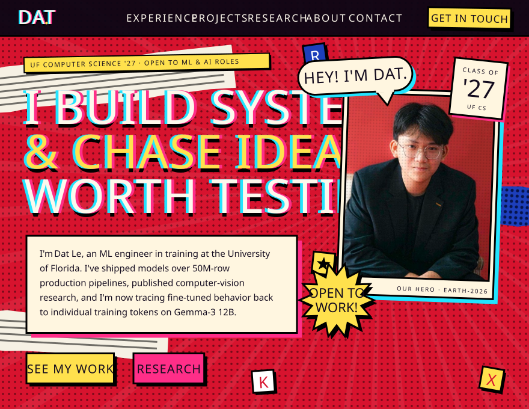</a>

<a href="https://dat-dev.com/#projects">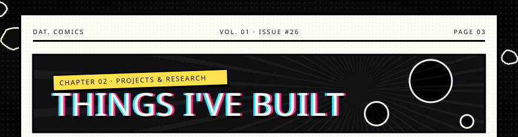</a> 
 
 
<a href="https://dat-dev.com/#projects">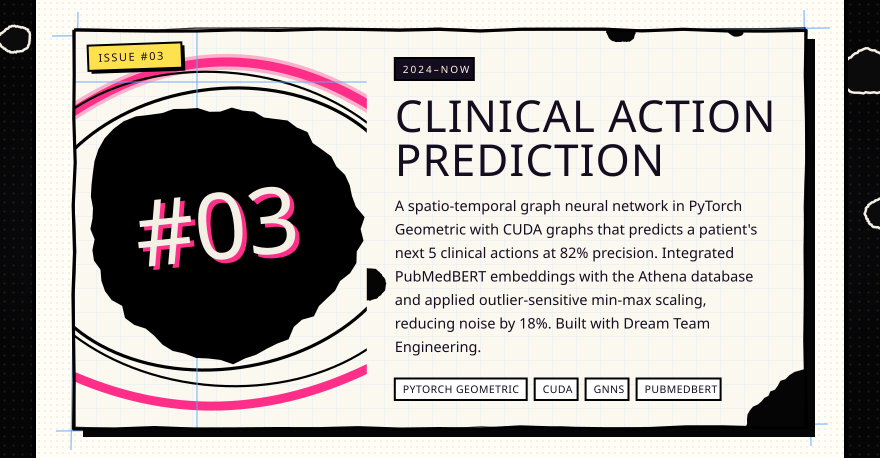</a> 
<a href="https://github.com/Dat-cool-repo/Train-of-four">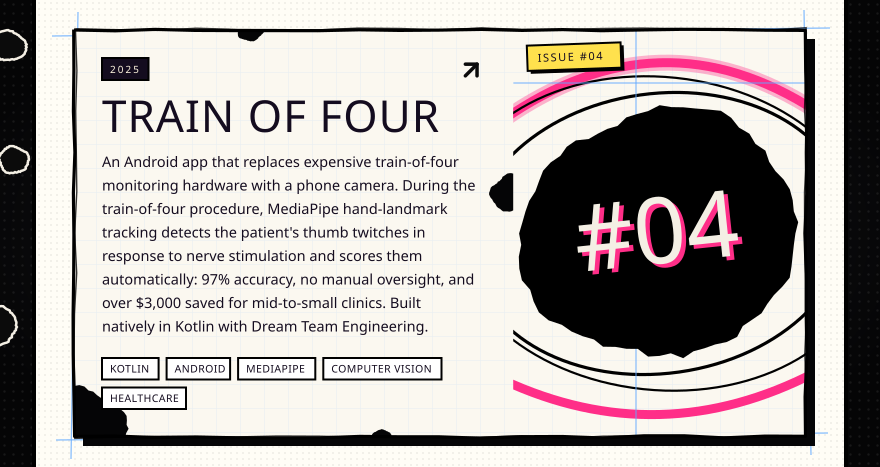</a> 
<a href="https://dat-dev.com/#projects">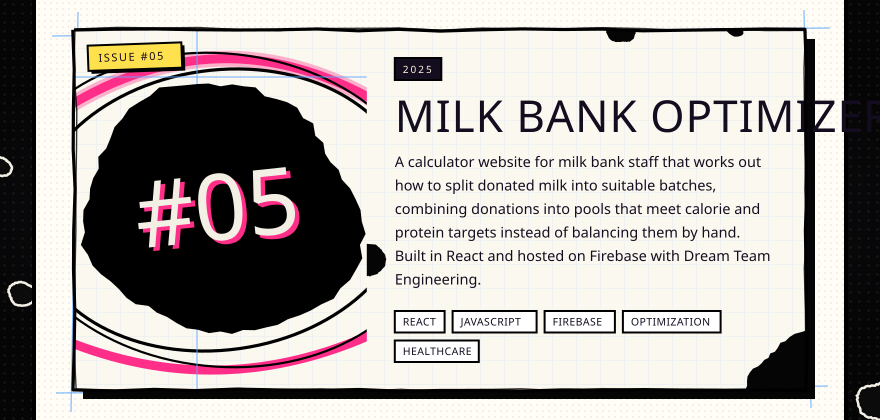</a> 
<a href="https://dat-dev.com/#projects">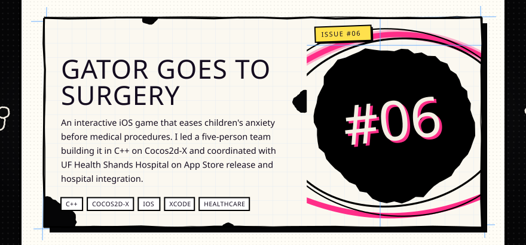</a> 
<a href="https://github.com/Dat-cool-repo/Horus">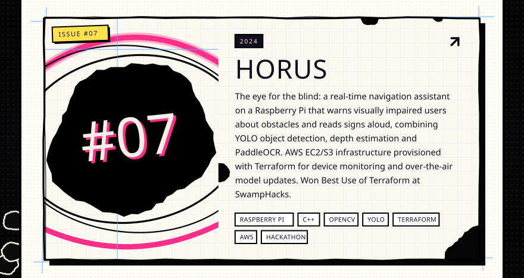</a> 
<a href="https://dat-dev.com/#projects">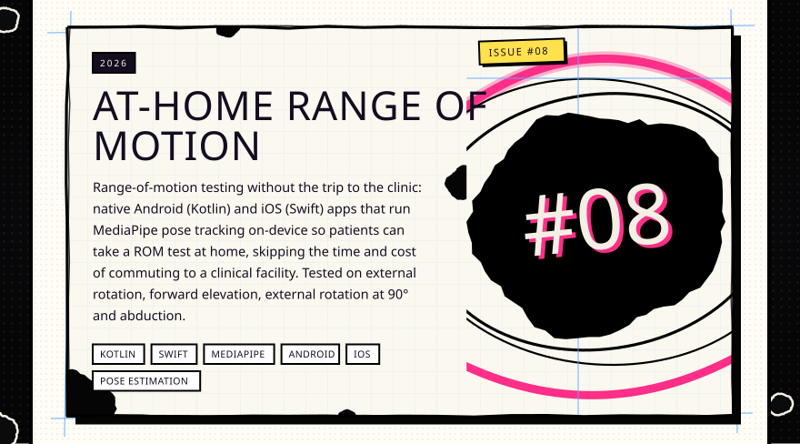</a> 
 
 
<a href="https://dat-dev.com/#research">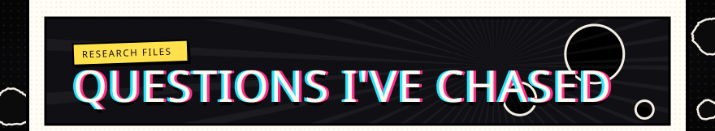</a> 
 

<a href="mailto:harydat12@gmail.com">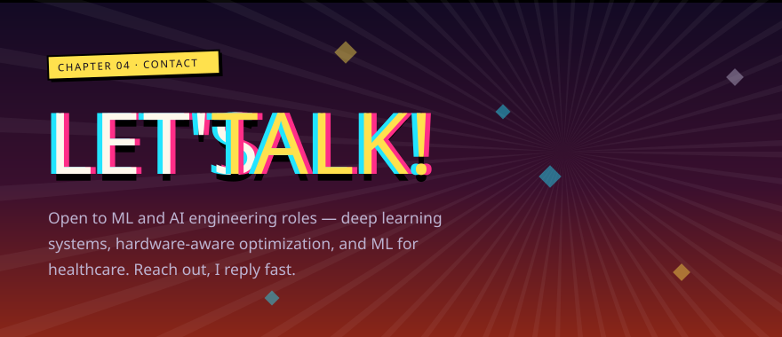</a>

&nbsp;&nbsp;&nbsp;&nbsp;

<a href="https://dat-dev.com">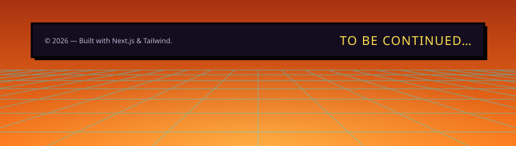</a>
